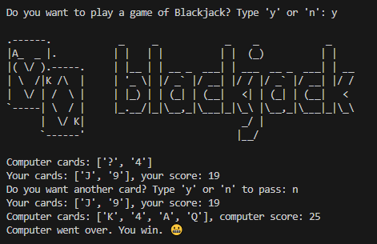

# BlackJack ♠️

This is a simple implementation of the classic card game **Blackjack** (also known as 21) in Python. 

The game follows the standard rules of BlackJack, where the player tries to beat the dealer by having a hand value closer to 21 whitout going over.

## How to play

1. Run the `main.py` script
2. Follow the on-screen prompts to play the game
3. Try to beat the dealer without exceeding 21!

## Requirements

- Python 3.x

## Screenshots

